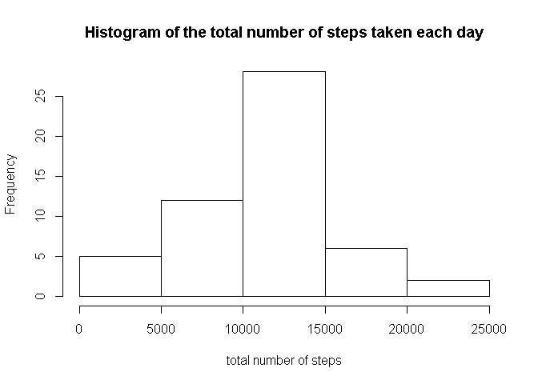
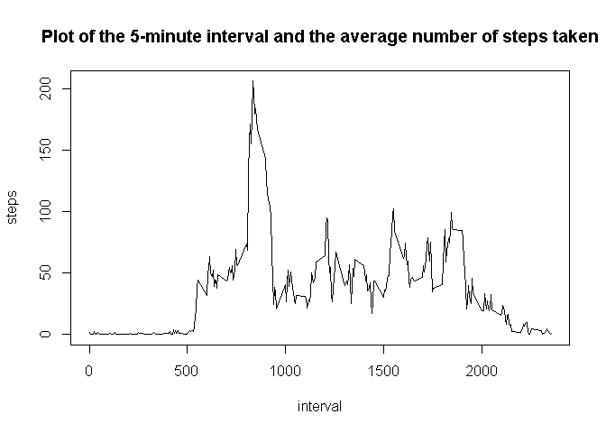
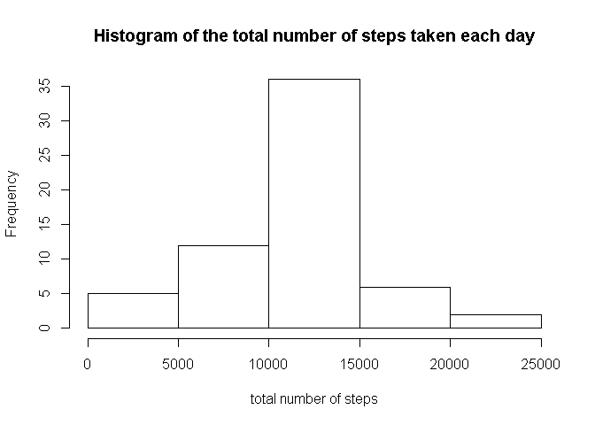
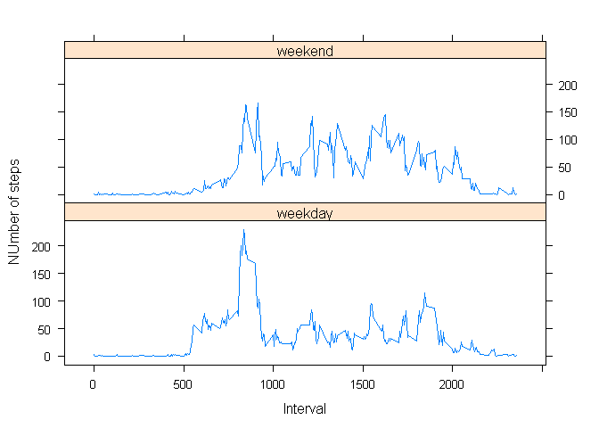

# Reproducible Research: Peer Assessment 1

###Loading and preprocessing the data
* Loading data


```r
d  <- read.csv("activity.csv",sep=",", header=T,stringsAsFactors=FALSE, na.strings="NA") 
```

* Preprocessing the data

```r
d$date<- as.Date(d$date)
```

###What is mean total number of steps taken per day?

* Calculating the total number of steps taken per day

```r
stepstotal<-aggregate(steps~date, data=d, "sum",na.action=na.pass)
```

* Histogram of the total number of steps taken each day

```r
hist(stepstotal$steps,  right=FALSE,main="Histogram of the total number of steps taken each day",xlab="total number of steps")   
```

 

* Mean and median of the total number of steps taken per day

```r
mean(stepstotal$steps,na.rm = T)
```

```
## [1] 10766.19
```

```r
median(stepstotal$steps,na.rm = T)
```

```
## [1] 10765
```

###What is the average daily activity pattern?

* Plot of the 5-minute interval and the average number of steps taken

```r
stepsinterval<-aggregate(steps~interval, data=d, "mean",na.rm= T)
with(stepsinterval, plot(interval, steps,type = "l", main = "Plot of the 5-minute interval and the average number of steps taken"))
```

 
* Which 5-minute interval, on average across all the days in the dataset, contains the maximum number of steps?

```r
stepsinterval$interval[which.max(stepsinterval$steps)]
```

```
## [1] 835
```

###Imputing missing values

* Calculating and report the total number of missing values in the dataset

```r
sum(is.na(d$steps))
```

```
## [1] 2304
```

###Devise a strategy for filling in all of the missing values in the dataset.
We use the mean for that 5-minute interval to fill NA-s
###Create a new dataset that is equal to the original dataset but with the missing data filled in.


```r
d$steps[d$interval==2330]
```

```
##  [1] NA  0  0  0  0  0  0 NA  0  0  0  0  0  0  0 56  0  0  0  0  0  0  0
## [24] 27  0  0  0  0  0  0  0 NA  0  0 NA  0 38  0  0 NA NA  0  0  0 NA  0
## [47]  0  0  0  0  0  0  0  0  0 17  0  0  0  0 NA
```

```r
#new$steps[is.na(new$steps)]<-stepsinterval$steps[new$interval==stepsinterval$interval]
#new
new<-merge(d,stepsinterval, by.x="interval", by.y="interval") #merging dataset with dataset having verage number of steps for that interval
new$steps.x[is.na(new$steps.x)]<-new$steps.y[is.na(new$steps.x)] 
new <- subset(new, select = c(steps.x,date,interval)) #dropping steps.y 
colnames(new)[1] <- "steps" #giving correct name to stpes column
new<-new[with(new, order(date,interval)), ] #ordering data with initial ordering
```

* Make a histogram of the total number of steps taken each day

```r
stepstotal<-aggregate(steps~date, data=new, "sum",na.action=na.pass)
hist(stepstotal$steps,  right=FALSE,main="Histogram of the total number of steps taken each day",xlab="total number of steps")   
```

 
* Calculate and report the mean and median total number of steps taken per day.


```r
mean(stepstotal$steps,na.rm = T)
```

```
## [1] 10766.19
```

```r
median(stepstotal$steps,na.rm = T)
```

```
## [1] 10766.19
```
After imputing missing values mean did not change and median increased. 
After imputing missing data  estimates of the total daily number of steps increased a little bit


### Are there differences in activity patterns between weekdays and weekends?
* Create a new factor variable in the dataset with two levels – “weekday” and “weekend”


```r
Sys.setlocale("LC_TIME","English United States") #setting english language for dates
```

```
## [1] "English_United States.1252"
```

```r
new$weekday<-weekdays((new$date))
new$day_type<-ifelse(new$weekday %in% c("Sunday","Saturday"),"weekend" ,"weekday") 
```

* Making a panel plot containing a time series plot (i.e. type = "l") of the 5-minute interval (x-axis) and the average number of steps taken, averaged across all weekday days or weekend days (y-axis). 

```r
stepsinterval<-aggregate(steps~interval+day_type, data=new, "mean",na.rm= T)
library(lattice)
xyplot(stepsinterval$steps ~ stepsinterval$interval | stepsinterval$day_type , layout = c(1, 2),type = "l",xlab="Interval",ylab="NUmber of steps")
```

 
